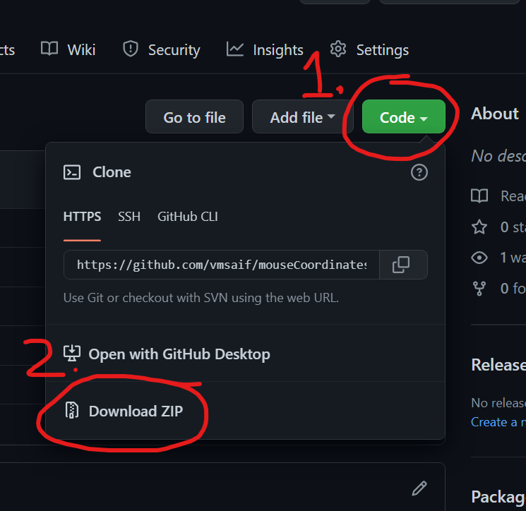

# Processing Canvas Coordinates

This is a visual representation of the coordinates of a Processing canvas. 

If you are new to processing, this simple sketch will help you to understand how the X and Y coordinates are placed on the canvas.

You even can start your drawing/sketch from the "a_drawing.pde" file of this reposity. 

## Instructions

If you are not familiar with git:

- you can download this repository as zip.
- Unzip, then start the "a_drawing.pde" to start drawing.
- [Important] Make sure you keep "a_drawing.pde" and "MOUSESCALE.pde" in the same directory/folder.

Here is a screenshot of the download button.

## Visual Representation

PS: I made it for my nephew to help him understand the coordinates. Hope this helps you too.  
